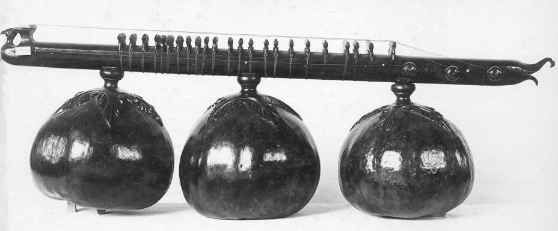

# Waarom plain text

## Pandoc draaien

Het programma `run.sh` is gemaakt om automatisch een PDF document te maken. Voeg enkel jouw eigen documenten toe aan de lijst van document.

```bash
#!/bin/bash

if [ ! -e eisvogel.tex ];
then
    echo "Downloading template"
    wget https://raw.githubusercontent.com/credmp/pandoc-latex-template/master/eisvogel.tex
fi

# build the document
pandoc preamble.md \
       001-intro.md \
       999-reference,md \
       -o "document.pdf" \
    -H meta/options.sty \
    -N \
    --from markdown \
    --template "eisvogel.tex" \
    --listings \
    --toc -V toc-own-page=true \
    --filter=pandoc-citeproc   \
    --biblio=meta/my-biblio.bib \
    --csl=meta/apa.csl
```

## Code

Zo laat je een code fragment zien.

```java
public class Example implements LoremIpsum {
	public static void main(String[] args) {
		if(args.length < 2) {
			System.out.println("Lorem ipsum dolor sit amet");
		}
	} // Obscura atque coniuge, per de coniunx
}
```

## Citaten

De APA richtlijnen [@apa]. Of als een footnoot [^1]

[^1]: dit staat in de voetnoot [@apa].

## Formules

Dit is een formule:

\begin{equation}\label{eq:neighbor-propability}
    p_{ij}(t) = \frac{\ell_j(t) - \ell_i(t)}{\sum_{k \in N_i(t)}^{} \ell_k(t) - \ell_i(t)}
\end{equation}

## Images

Tekst voor het plaatje.
 


En dit staat na het plaatje.

{ width=50% }

Je kan ook verwijzen naar plaatjes, bijvoorbeeld figuur  \ref{fig:met}.

## Tables

Of verwijs naar onderstaande tabel \ref{table:second}.

| Tables        | Are           | Cool  |
| ------------- |:-------------:| -----:|
| col 3 is      | right-aligned | $1600 |
| col 2 is      | centered      |   $12 |
| zebra stripes | are neat      |    $1 |

Table: another table syntax \label{table:second}

## Awesomebox

::: note
This is a note
:::

and another

::: caution
Danger will robinson, danger!
:::


::: tip
Using docker saves you a lot of hassle!
:::
